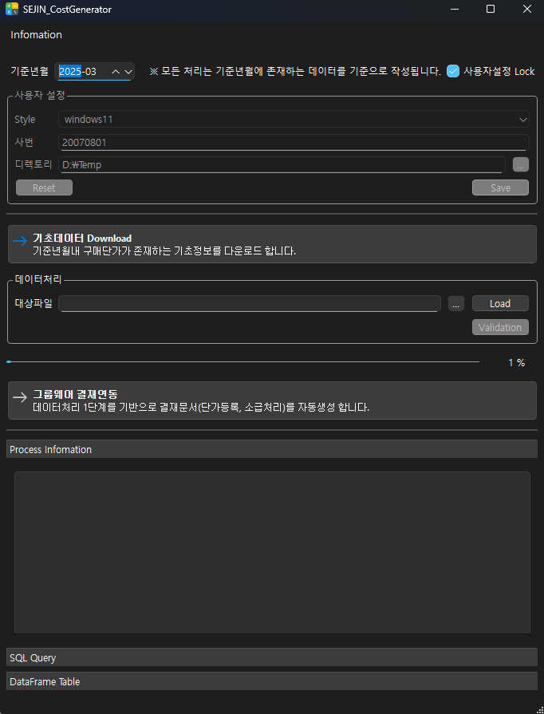
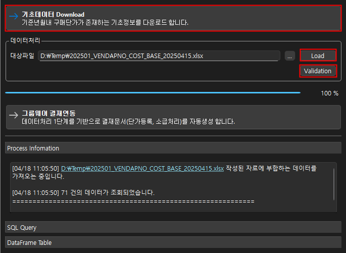
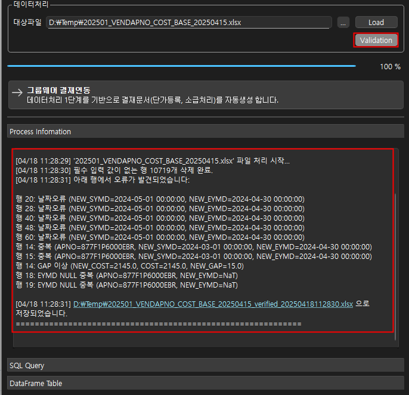
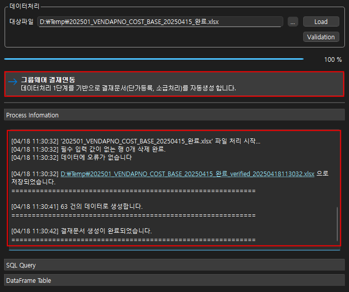
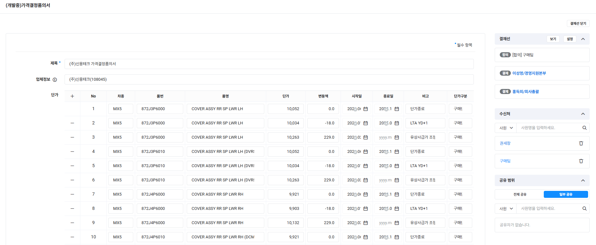

# 사용자 매뉴얼: 비용 생성기 자동화 시스템

## 1. 소개

본 매뉴얼은 비용 생성기 자동화 시스템의 사용 방법을 안내합니다. 이 시스템은 네이버 웍스 그룹웨어와 연동된 결재 문서 자동 생성 시스템으로, ERP 데이터 연동 및 승인 프로세스 자동화를 통해 업무 효율성과 정확성을 향상시키는 데 목적이 있습니다.

## 2. 주요 기능

* **기초데이터 다운로드:** 사내 ERP DB에서 기초데이터를 조회하여 대용량 엑셀 파일로 다운로드합니다.
* **Excel 기반 데이터 처리:** 기초데이터 기반으로 작성된 Excel 파일에서 데이터를 로드하여 ERP 입력데이터를 생성합니다.
* **사용자 데이터 검증:** Excel 데이터 입력시 제한사항을 강제하여 사용자의 잘못된 입력을 방지합니다. 또한 Validation 기능을 통하여 사용자 입력데이터를 Excel로 재확인할수 있습니다.
* **사용자 작성자료 링크:** ProceeInformation창을 통하여, 사용자의 작성자료의 정상/오류 정보를 확인할 수 있습니다. 바로가기 링크를 통해서 해당파일을 직접확인할수 있는 편의를 제공합니다.
* **네이버 웍스 API 연동 결재 문서 생성:** 네이버 웍스 API를 활용하여 결재 문서를 자동으로 생성합니다.
* **실시간 승인 상태 추적:** 네이버 웍스 API와 REST API 서버를 통해 결재 문서의 실시간 승인 상태를 추적합니다.
* **사내 REST 서버를 통한 승인 결과 수신:** 네이버 웍스와 ERP 사이에 위치한 REST API 서버를 통해 승인 결과를 수신합니다.
* **Oracle DB 업데이트 자동화:** 결재 문서가 최종 승인되면, REST API 서버를 통해 Oracle DB에 ERP 데이터를 자동으로 업데이트합니다.
* **사용자 인증 및 암호화 관리:** 사용자 인증 및 암호화 관리를 통해 시스템의 보안을 강화합니다.

## 3. 시스템 사용 방법 (cost_generator.exe 실행)

1. `cost_generator.exe`를 실행하여 프로그램을 시작합니다. 
2. 로그인 화면이 나타나면, 사용자 인증을 위해 ID/PW를 입력하여 로그인합니다.
3. 기초데이터 Download
   1. 기초데이터 Download 를 이용하여, 엑셀파일 로드를 위한 기초데이터를 다운로드합니다.
   2. 사용자는 엑셀파일 로드를 위한 기초데이터를 다운로드한 후, 결재문서를 위한 Excel 파일을 편집합니다.
   3. 기초데이터 Excel 문서내에 기본 작성가이드 Sheet가 추가됩니다.
   4. 프로그램 Information - Guide File 메뉴를 통해 사용자가이드(Guide.xlsx) 문서를 수정/저장하면 사용자별 맞춤형 가이드 Sheet가 생성됩니다.
4. 사용자 Excel 파일Load

   1. 화면에서 "Load" 버튼을 클릭하여 결재 문서 생성에 필요한 엑셀 파일을 로드합니다.
   2. 데이터 로드에 대한 프로그램 메시지를 확인합니다.
   3. 정상적으로 데이터가 로드되었으면, "Validation" 버튼이 활성화 됩니다.
5. Validation 검증

   1. "Validation" 버튼을 클릭하여 데이터 검증을 수행합니다.
   2. 검증파일에 오류가 있으면, 오류에 대한 프로그램 메시지를 확인하고 데이터를 수정합니다. 
   3. 사용자 검증편의를 위하여 검증데이터 확인시에 파일명_validated_timestamp.xlsx로 매번 다른이름으로 저장됩니다.
   4. 검증파일에 오류가 없으면, "그룹웨어 결재연동" 버튼이 활성화 됩니다.
6. 그룹웨어 결재연동

   1. "그룹웨어 결재연동" 버튼을 클릭하여 네이버 웍스에 결재 문서 생성 요청을 보냅니다.
   2. 프로그램 로그인시 사용자 권한에 따라 네이버 웍스 SSO 인증정보가 실행됩니다.
   3. 네이버 웍스 인증 화면이 팝업이 되면 로그인을 수행한 후, 자동으로 결재 문서가 생성됩니다.
   4. 결재 문서가 최종 승인되면, ERP 데이터가 자동으로 업데이트됩니다. (향후 반영예정)

### 4 엑셀 파일 작성 상세 방법 (ExcelData_Guide 참조)

* 엑셀 파일은 특정 양식에 맞춰 작성되어야 합니다. `data_processing.py` 파일 내에 정의된 엑셀 파일 양식을 참고하여 작성하십시오.
* 데이터 형식: 각 필드에 맞는 데이터 형식을 준수해야 합니다. (예: 날짜, 숫자, 텍스트)
* `data_processing.py`에서는 Pandas 라이브러리를 사용하여 엑셀 파일을 읽고 처리합니다. 엑셀 파일의 각 열은 Pandas DataFrame의 열로 매핑됩니다.

* 가이드 링크
* [엑셀 데이터 작성 가이드]([ExcelData_guide.md](https://github.com/devSCKwon/sejin_costgenerator_releases/blob/main/ExcelData_Guide.md))