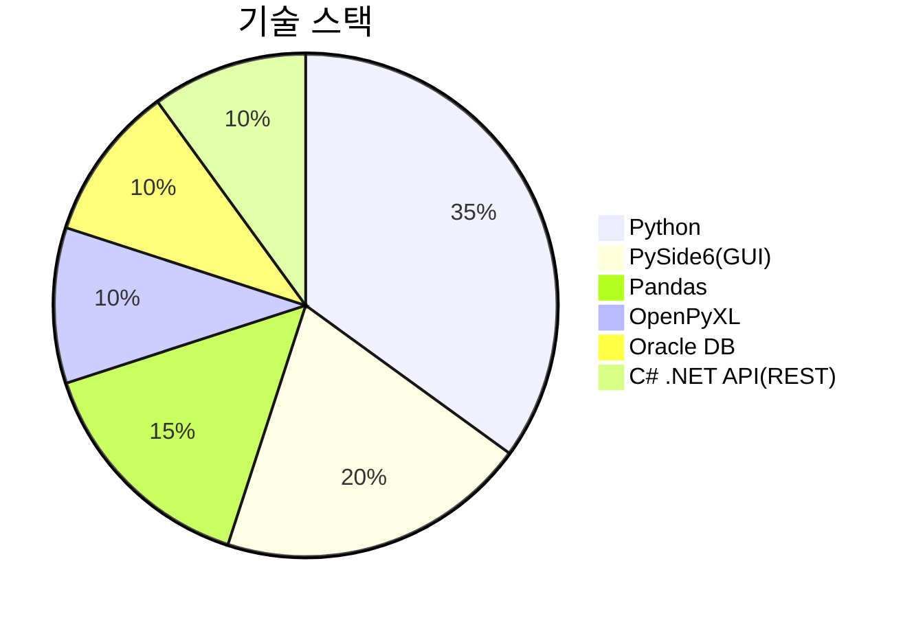
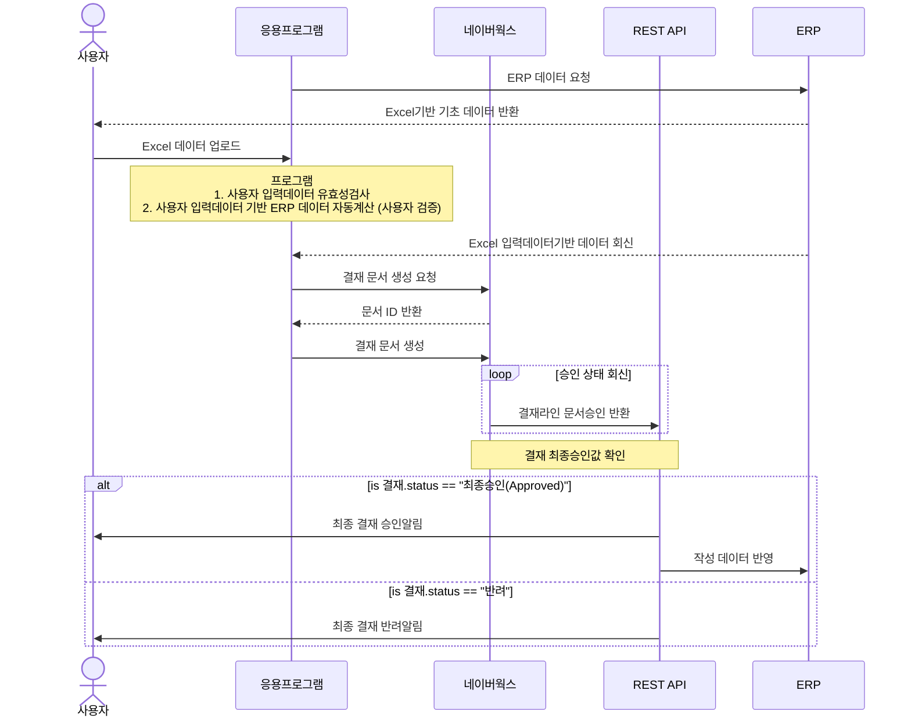

# 비용 생성기 자동화 시스템 설계 문서

## 개요

본 프로젝트는 네이버 웍스 그룹웨어와 연동된 결재 문서 자동 생성 시스템을 구축하는 것을 목표로 합니다. ERP 데이터 연동 및 승인 프로세스 자동화를 통해 업무 효율성과 정확성을 향상시키는 데 중점을 두고 있습니다. 사용자가 엑셀 파일을 업로드하면, 응용프로그램이 네이버 웍스에 결재 문서를 자동 생성하고, 네이버 웍스와 ERP 사이에 위치한 NET REST API 서버를 통해 승인 상태를 확인하며, 승인 완료 시 REST API 서버에서 ERP 데이터를 반영합니다. 특히, `workAPI_processing.py` 파일에서 네이버 웍스 API 연동을 위한 JWT 생성 및 OAuth2 토큰 요청, 결재 문서 생성 등의 핵심 기능을 구현하고 있습니다.

## 주요 기능

* **Excel 기반 데이터 처리:** 사용자가 엑셀 파일을 업로드하여 결재 문서 생성에 필요한 데이터를 제공합니다. `data_processing.py` 파일에서 엑셀 파일 읽기 및 데이터 처리를 담당합니다.
* **네이버 웍스 API 연동 결재 문서 생성:** 네이버 웍스 API를 활용하여 결재 문서를 자동으로 생성합니다. `workAPI_processing.py` 파일에서 JWT 생성, OAuth2 토큰 요청, 결재 문서 생성 등의 기능을 수행합니다.
* **실시간 승인 상태 추적:** 네이버 웍스 API와 REST API 서버를 통해 결재 문서의 실시간 승인 상태를 추적합니다. `workAPI_processing.py` 파일에서 승인 상태 확인을 처리합니다.
* **사내 REST 서버를 통한 승인 결과 수신:** 네이버 웍스와 ERP 사이에 위치한 REST API 서버를 통해 승인 결과를 수신합니다. `workAPI_processing.py` 파일에서 REST API 서버와의 통신을 처리합니다.
* **Oracle DB 업데이트 자동화:** 결재 문서가 최종 승인되면, REST API 서버를 통해 Oracle DB에 ERP 데이터를 자동으로 업데이트합니다. `data_processing.py` 파일에서 Oracle DB와의 연동을 통해 ERP 데이터를 업데이트합니다.
* **사용자 인증 및 세션 관리:** 사용자 인증 및 세션 관리를 통해 시스템의 보안을 강화합니다. `login.py` 파일에서 사용자 로그인 및 인증 기능을 제공합니다.
* **기초데이터 다운로드:** `data_processing.py` 파일에서 Oracle DB에서 기초데이터를 조회하여 엑셀 파일로 다운로드 합니다.
* **데이터 로드:** `data_processing.py` 파일에서 엑셀 파일에서 데이터를 로드하여, 데이터 검증 및 가공을 합니다.

## 디렉토리 구조

프로젝트의 디렉토리 구조는 아래와 같습니다:

```sejin_costgenerator/

CostGenerator/
├── .gitignore                     # Git에서 추적하지 않을 파일 목록
├── costgenerator.py               # 비용 생성기 응용프로그램의 주요 실행 파일
├── data_processing.py             # 데이터 처리 관련 코드
├── dataObject.py                  # 데이터 객체 정의 코드
├── login.py                       # 사용자 인증 관련 코드
├── ui_main.py                     # UI 레이아웃 정의 코드
├── resource_rc.py                 # 리소스 파일
├── workAPI_processing.py          # 네이버 웍스 API 연동 관련 코드
├── doc/                           # 문서 관련 파일 디렉토리
│   ├── project_overview.md        # 프로젝트 개요 및 목표 문서
│   ├── design.md                  # 시스템 설계 문서
└── README.md                      # 프로젝트 설명 문서 (현재 파일)

```

## 기술 스택



## 업무 흐름

응용프로그램의 업무 흐름은 다음과 같습니다:

1. 사용자가 Excel 파일을 업로드합니다.
2. 응용프로그램은 업로드된 데이터를 검증합니다.
3. 네이버 웍스에 결재 문서 생성 요청을 보냅니다.
4. 네이버 웍스는 결재 문서 ID를 반환합니다.
5. 응용프로그램은 네이버 웍스에 결재 문서 생성을 수행합니다.
6. 승인 상태를 주기적으로 확인하며, NET REST API 서버를 통해 승인 상태를 수신합니다.
7. 최종 승인(Approved) 시 NET REST API 서버에서 ERP 데이터 업데이트가 이루어집니다.



## 보안 고려사항

1. 사용자 인증: 암호화된 자격 증명 저장
2. API 통신: HTTPS 전송
3. 세션 관리: JWT 토큰 기반 인증